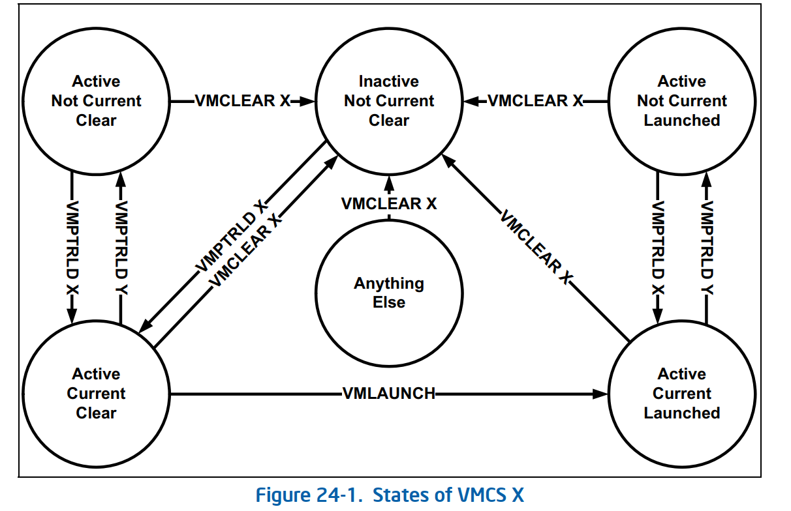
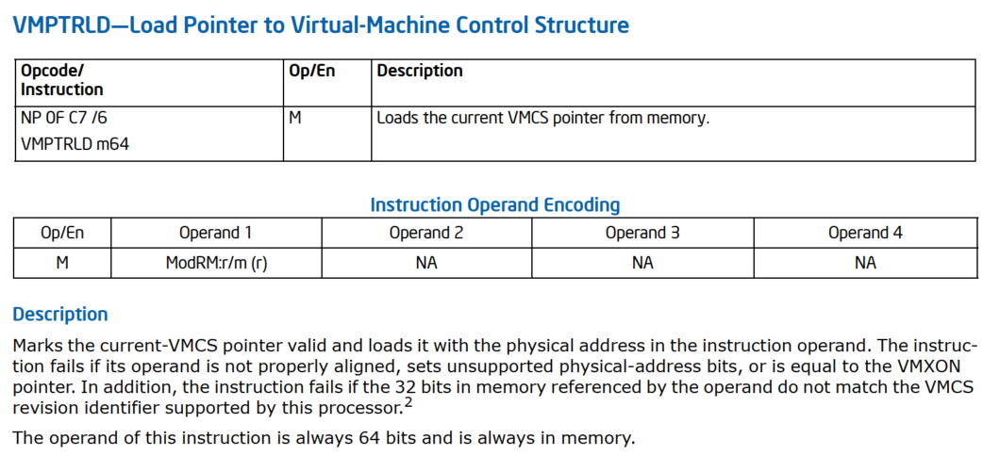

## vcpu_load 流程
### INTEL vcpu_run
x86 intel vcpu run需要两步
1. 执行`VMPTRLD`指令, load vmcs结构体首地址(`vcpu_load`)
2. 执行`vmlaunch/vmresume` 指令, 进入guest(`vcpu_enter_guest`)

### vcpu_load
在介绍vcpu_load相关流程之前，我们先来看下和vmcs相关指令,
在执行这些指令的时候以及vmcs状态转换

<div style="text-align: center;">

<br />
图1. vmx状态
</div>

Intel x86 为了使多个VMCS可以共存，标记了VMCS状态:**Current && 
Not Current**, 表示该VMCS是不是当前CPU需要运行的VMCS结构.<br/>
这里，VMPTRLD指令的作用就是使Not Current VMCS => Current VMCS。<br />
指令的详细解释为

<div style="text-align: center;">

<br />
图1. vmptrld指令
</div>

从上图可以看出该指令有一个操作数，这个操作数是一个要成为Current VMCS
结构的首地址，实际上就是一个current vmcs ptr load过程<br />

*** 

我们来看下load的具体流程
1. 首先会在create vcpu的流程中会执行
```
kvm_vm_ioctl
    case KVM_CREATE_VCPU: 
    kvm_vm_ioctl_create_vcpu
        kvm_arch_vcpu_create
            kvm_x86_ops->vcpu_create ==> vmx_create_vcpu 
                vmx_vcpu_load
                    vmcs_load 
```

我们来看下vmx_vcpu_load的相关流程

```C/C++
void vmx_vcpu_load(struct kvm_vcpu *vcpu, int cpu)
{
	struct vcpu_vmx *vmx = to_vmx(vcpu);
	bool already_loaded = vmx->loaded_vmcs->cpu == cpu;
	
	...
	
	//和该cpu上的CURRENT VMCS比较, 如果不相同, 则替换VMCS结构体
	if (per_cpu(current_vmcs, cpu) != vmx->loaded_vmcs->vmcs) {
    	per_cpu(current_vmcs, cpu) = vmx->loaded_vmcs->vmcs;        //去load vcpu
    	vmcs_load(vmx->loaded_vmcs->vmcs);
    	indirect_branch_prediction_barrier();
	}

	...

}

static inline void vmcs_load(struct vmcs *vmcs)
{
    u64 phys_addr = __pa(vmcs);										//获取物理地址
    bool error;

    if (static_branch_unlikely(&enable_evmcs))
        return evmcs_load(phys_addr);

    asm volatile (__ex("vmptrld %1") CC_SET(na)						//执行VMPTRLD load current vmcs
              : CC_OUT(na) (error) : "m"(phys_addr));
    if (unlikely(error))
        printk(KERN_ERR "kvm: vmptrld %p/%llx failed\n",
               vmcs, phys_addr);
}
```

2. 另外，我们知道qemu-kvm 和kernel kvm mod配合是，QEMU-KVM为每一个VCPU创建一个线程，
而所以当进行VCPU所在线程需要调度时，也需要进行VCPU的调度，实际上就是更新Current VMCS
的值，也应该走上面的流程。相关代码流程如下：

```C/C++
kvm_sched_in
   kvm_arch_vcpu_load 
       kvm_x86_ops->vcpu_load(vcpu, cpu);       ==> vmx_vcpu_load
```
而和kvm_sche_in被初始化给了struct preempt_notifier数据结构
代码流程为:

```C/C++
static int kvm_vm_ioctl_create_vcpu(struct kvm *kvm, u32 id) 
{
    ...
    preempt_notifier_init(&vcpu->preempt_notifier, &kvm_preempt_ops);
    ...
}
```
