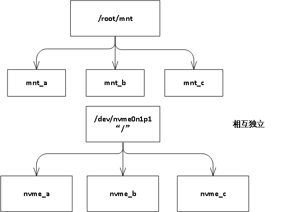
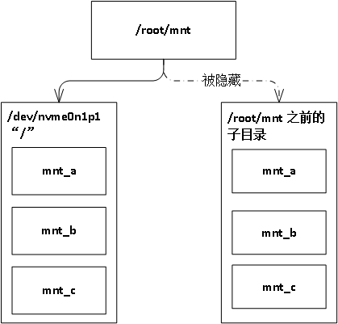

# mountpoint
假设mount a to b, 可以理解为在vfs层，将a dentry中的覆盖到
b dentry的路径，b dentry并没有消失，只是说当访问到b dentry
的路径时，将会访问到a dentry

举个例子:
我们将 /dev/nvme0n1p1块设备mount 到 /root/mnt目录上
```
mkdir -p /root/mnt
# mount /dev/nvme0n1p1 /root/mnt
```
对于上面的情景而言, 它是将代表/dev/nvme0n1p1根 inode
的根dentry  mount到/root/mnt dentry的path上，当访问到
/root/mnt路径时，将访问到的是/dev/nvme0n1p1的根路径.

我们来看下mount前后dentry之前的关系图

<div style="text-align: center;">

<br/>
图3. mount前
</div>

***

<div style="text-align: center;">

<br />
图3. mount后
</div>

# 代码流程
## path_init流程
在了解mount 之前，首先了解下path_init在遇到挂载点处的处理流程
假设执行查看mountpoint的命令`#ls /root/mnt`

实际上会调用系统调用
`sys_open("/root/mnt", ...)`的操作

## mount流程
代码流程
```
sys_mount
    ksys_mount
        do_mount
           do_new_mount
                do_add_mount
                    graft_tree
                        attach_recursive_mnt
```
### attach_recursive_mnt

1. 参数
|类型|名称|作用|
|-|-|-|
|struct mount *|source_mnt|源mnt|
|struct mount *|dest_mnt|目的mnt|
|struct mountpoint *|dest_mp|目的mountpoint|
|struct path *|parent_path||

关于source_mnt和dest_mnt中的vfsmount, 需要注意的是，
vfsmount是root_dentry和superblock之间的关系。
在该函数执行之前，已经申请好source_mnt，准备好dest_mnt，dest_mp,
该函数的作用就是建立他们几个之前的关系

2. 我们来看下整个函数的流程

```C/C++
static int attach_recursive_mnt(struct mount *source_mnt,
            struct mount *dest_mnt,
            struct mountpoint *dest_mp,
            struct path *parent_path)
{
    HLIST_HEAD(tree_list);
    struct mnt_namespace *ns = dest_mnt->mnt_ns;
    struct mountpoint *smp;
    struct mount *child, *p;
    struct hlist_node *n;
    int err;

    /* Preallocate a mountpoint in case the new mounts need
     * to be tucked under other mounts.
     */
    smp = get_mountpoint(source_mnt->mnt.mnt_root);     //得到source_mnt
    if (IS_ERR(smp))
        return PTR_ERR(smp);

    /* Is there space to add these mounts to the mount namespace? */
    if (!parent_path) {
        err = count_mounts(ns, source_mnt);
        if (err)
            goto out;
    }

    if (IS_MNT_SHARED(dest_mnt)) {                      //该mnt是shared属性
        err = invent_group_ids(source_mnt, true);
        if (err)
            goto out;
        err = propagate_mnt(dest_mnt, dest_mp, source_mnt, &tree_list); //进行传播
        lock_mount_hash();
        if (err)
            goto out_cleanup_ids;
        for (p = source_mnt; p; p = next_mnt(p, source_mnt))
            set_mnt_shared(p);
    } else {
        lock_mount_hash();
    }
     if (parent_path) {
         detach_mnt(source_mnt, parent_path);
         attach_mnt(source_mnt, dest_mnt, dest_mp);
         touch_mnt_namespace(source_mnt->mnt_ns);
     } else {
         mnt_set_mountpoint(dest_mnt, dest_mp, source_mnt);  //在这里会设置mnt_parent
         commit_tree(source_mnt);
     }

     hlist_for_each_entry_safe(child, n, &tree_list, mnt_hash) {
         struct mount *q;
         hlist_del_init(&child->mnt_hash);
         q = __lookup_mnt(&child->mnt_parent->mnt,
                  child->mnt_mountpoint);
         if (q)
             mnt_change_mountpoint(child, smp, q);
         commit_tree(child);
     }
     put_mountpoint(smp);
     unlock_mount_hash();

     return 0;

  out_cleanup_ids:
     while (!hlist_empty(&tree_list)) {
         child = hlist_entry(tree_list.first, struct mount, mnt_hash);
         child->mnt_parent->mnt_ns->pending_mounts = 0;
         umount_tree(child, UMOUNT_SYNC);
     }
     unlock_mount_hash();
     cleanup_group_ids(source_mnt, NULL);
  out:
     ns->pending_mounts = 0;

     read_seqlock_excl(&mount_lock);
     put_mountpoint(smp);
     read_sequnlock_excl(&mount_lock);

     return err;
 }

```

# 基本数据结构
[基本数据结构](./mount.md)
